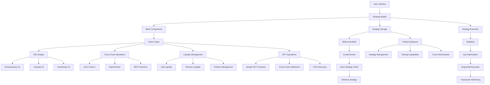

# CrossChain DEX Aggregator & Strategy Builder
> Building, Executing, and Sharing Cross-Chain Trading Strategies Made Simple

This project is designed to enable users to create and execute complex blockchain actions seamlessly. It supports various decentralized exchanges (DEXs), cross-chain operations, and advanced storage management, ensuring smooth and efficient strategy execution.

## 🌟 Problem Statements

1. **Fragmented Liquidity**: Users struggle to find the best rates across multiple DEXs and chains, leading to suboptimal trades and higher costs.

2. **Complex Cross-Chain Operations**: Managing assets across different blockchains requires multiple tools and complex interactions, creating a high barrier to entry.

3. **Strategy Management**: Traders lack tools to create, save, and share their successful trading strategies across multiple DEXs and chains.

## 💡 Solutions

1. **Unified Trading Interface**: 
   - Aggregates liquidity from leading DEXs (PancakeSwap, Uniswap, SushiSwap)
   - Integrates cross-chain protocols (Squid Router, 1inch Fusion+)
   - Provides best execution paths and rates

2. **Seamless Cross-Chain Operations**:
   - One-click cross-chain asset transfers
   - Integrated NFT purchases across chains
   - MEV protection against frontrunning

3. **Strategy Builder & Storage**:
   - Visual strategy builder interface
   - BNB Greenfield integration for strategy storage
   - Strategy sharing and future monetization capabilities

# Objectives: 

The goal is to simplify the user experience on BNBChain by offering one-click bridging and trading capabilities. This will allow users to own and manage their assets across different chains while easily trading on BNBChain, ensuring the lowest fees, best prices, and additional services such as MEV protection. This comprehensive approach aims to enhance convenience and efficiency for all users within the BNBChain ecosystem.

## 🚀 Key Features

### Trading Features
- Multi-DEX aggregation (PancakeSwap V3, Uniswap V3, SushiSwap V3)
- Cross-chain swaps via 1inch Fusion+
- Squid Router integration for optimal cross-chain routes
- MEV protection layer
- Real-time price comparison across DEXs

### Strategy Building
- Visual block-based strategy builder
- Multiple action types support:
  - Swaps
  - Liquidity provision
  - Cross-chain transfers
  - NFT purchases
- Strategy testing and simulation

### Storage & Sharing
- BNB Greenfield integration for strategy storage
- Personal strategy dashboard
- Strategy sharing capabilities
- Future monetization framework

### NFT Features
- Cross-chain Seraph NFT purchases
- Integrated price discovery
- Automated cross-chain execution

## 🏗 Architecture

### Strategy Creation Flow

## Flow Explaination

#### 1. Action Initiation
- **User-Created Blocks**: Users can construct blocks representing different types of actions.
- **Custom Parameters and Validation**: Each block type has tailored parameters and built-in validation mechanisms.
- **Multi-DEX and Cross-Chain Support**: The system is compatible with multiple DEXs and cross-chain protocols, enhancing versatility.

#### 2. Cross-Chain Operations
- **Integrated Squid Router**: Ensures optimal routing for cross-chain transactions.
- **1inch Fusion+ for Atomic Swaps**: Supports secure, atomic swaps across chains.
- **MEV Protection**: Implements strategies to mitigate front-running and ensure fair execution.
- **NFT Purchases Across Chains**: Manages and facilitates cross-chain NFT buying.

#### 3. Storage Management
- **Personal Bucket Creation**: Users can create individual storage buckets on BNB Greenfield.
- **JSON-Based Strategy Storage**: Strategies are stored as JSON files for easy access and management.
- **Retrieval and Sharing**: Provides robust mechanisms for retrieving and sharing stored strategies.

#### 4. Strategy Execution
- **Parameter Validation**: Ensures all parameters are checked and validated before execution.
- **Gas Optimization**: Includes gas-saving techniques to minimize transaction costs.
- **Sequential Transaction Handling**: Executes transactions in a precise order for reliability.
- **Transaction Monitoring**: Actively tracks the status of transactions to ensure successful completion.

## 💼 Use Cases

1. **Cross-Chain Trader**
   - Swap tokens across multiple chains
   - Find best rates across DEXs
   - Execute complex trading strategies

2. **NFT Collector**
   - Purchase Seraph NFTs across chains
   - Optimize gas costs for purchases
   - Automated cross-chain settlements

3. **Strategy Creator**
   - Build custom trading strategies
   - Store strategies on BNB Greenfield
   - Share and monetize successful strategies

## 🛠 Technical Integration

- **Cross-Chain Protocols**:
  - Squid Router for optimal cross-chain routing
  - 1inch Fusion+ for atomic cross-chain swaps
  - Custom MEV protection layer

- **DEX Integration**:
  - PancakeSwap V3
  - Uniswap V3
  - SushiSwap V3

- **Storage Solution**:
  - BNB Greenfield for strategy storage
  - Decentralized strategy sharing

## 🔒 Security Features

- MEV Protection
- Slippage Control
- Cross-chain Transaction Security
- Audited Smart Contracts

## 🚀 Future Roadmap

1. Strategy Marketplace
2. Advanced Analytics Dashboard
3. Mobile Application
4. Social Trading Features
5. Strategy Performance Tracking
